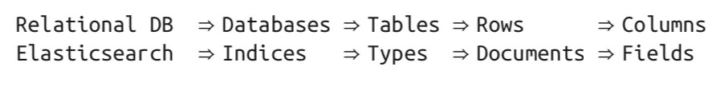
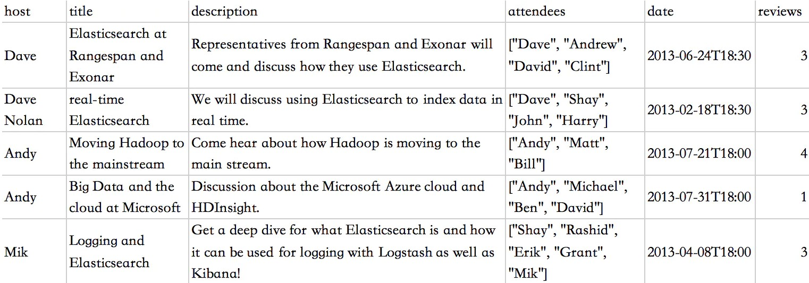
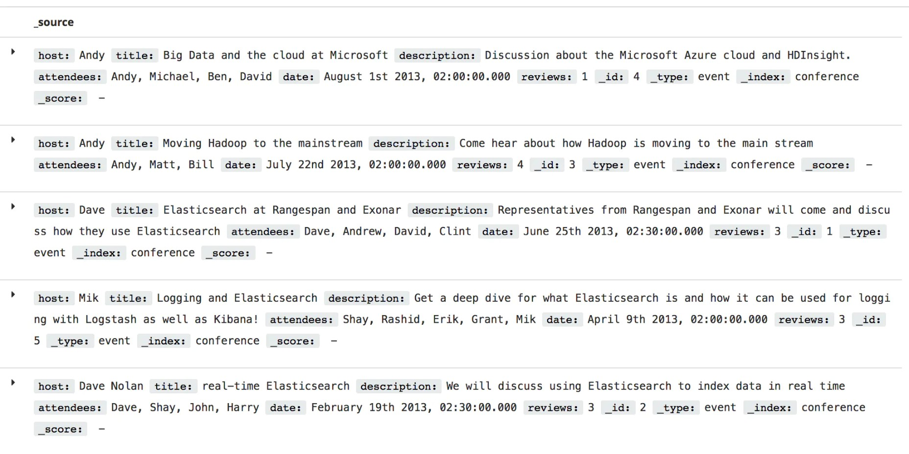

# Elasticsearch基本概念
**全文搜索(Full-text Search)**
    
         全文检索是指计算机索引程序通过扫描文章中的每一个词,对每一个词建立一个索引,指明
    该词在文章中出现的次数和位置,当用户查询时,检索程序就根据事先建立的索引进行查找,并
    讲查找的结果反馈给用户的检索方式。
        在全文搜索的世界中,存在几个庞大的帝国,也就是主流工具,主要有:
      
  - Apache Lucene
  - Elasticsearch
  - Ferret
    
**倒序索引（Inverted Index)**  

        该索引表中的每一项都包括一个属性值和具有该属性值的各记录的地址。由于不是由记录来
    确定属性值，而是由属性值来确定记录的位置，因而称为倒排索引(inverted index)。Elasticsearch
    能够实现快速、高效的搜索功能，正是基于倒排索引原理。
   
**节点 & 集群（Node & Cluster）**  

         Elasticsearch 本质上是一个分布式数据库，允许多台服务器协同工作，每台服务器可以运行多个
    Elasticsearch实例。单个Elasticsearch实例称为一个节点（Node），一组节点构成一个集群（Cluster）。
   
**索引（Index）**  

        Elasticsearch 数据管理的顶层单位就叫做 Index（索引），相当于关系型数据库里的数据库的概念。
    另外，每个Index的名字必须是小写。

**文档（Document）**  

        Index里面单条的记录称为 Document（文档）。许多条 Document 构成了一个 Index。Document 使用
     JSON 格式表示。同一个 Index 里面的 Document，不要求有相同的结构（scheme），但是最好保持相同，
     这样有利于提高搜索效率。
     
     
 **类型（Type）**  
 
        Document 可以分组，比如employee这个 Index 里面，可以按部门分组，也可以按职级分组。这种分组
    就叫做 Type，它是虚拟的逻辑分组，用来过滤 Document，类似关系型数据库中的数据表。不同的 Type 应
    该有相似的结构（Schema），性质完全不同的数据（比如 products 和 logs）应该存成两个 Index，而不是
    一个 Index 里面的两个 Type（虽然可以做到）。
    
**文档元数据（Document metadata）**

      文档元数据为_index, _type, _id, 这三者可以唯一表示一个文档，_index表示文档在哪存放，_type表
    示文档的对象类别，_id为文档的唯一标识。
    
**字段（Fields）**

         每个Document都类似一个JSON结构，它包含了许多字段，每个字段都有其对应的值，多个字段组成了一个
     Document，可以类比关系型数据库数据表中的字段。在 Elasticsearch 中，文档（Document）归属于一种类型
    （Type），而这些类型存在于索引（Index）中，下图展示了Elasticsearch与传统关系型数据库的类比：
   
   
**Elasticsearch入门**  

        Elasticsearch提供了多种交互使用方式，包括Java API和RESTful API ，本文主要介绍RESTful API 。所有
    其他语言可以使用RESTful API 通过端口 9200 和 Elasticsearch 进行通信，你可以用你最喜爱的 web 客户端
    访问 Elasticsearch 。甚至，你还可以使用 curl 命令来和 Elasticsearch 交互。
    
   一个Elasticsearch请求和任何 HTTP 请求一样，都由若干相同的部件组成:
   
    curl -X<VERB> '<PROTOCOL>://<HOST>:<PORT>/<PATH>?<QUERY_STRING>' -d '<BODY>'
    
   返回的数据格式为JSON，因为Elasticsearch中的文档以JSON格式储存。其中，被 < > 标记的部件：  
   
   | 部件 | 说明 |
   | :------:|------|
   | VERB| 适当的HTTP方法或谓词:GET,POST,PUT,HEAD或者DELETE。|
   | PROTOCOL| http或者https(如果你在Elasticsearch前面有一个https代理)|
   | HOST| Elasticsearch集群中任意节点的主机名,或者用localhost代表本机上的节点|
   | PORT| 运行Elasticsearch HTTP服务的端口号,默认是9200|
   | PATH| API的终端路径(例如_count将返回集群中文档的数量)。Path可能包含多 个组件,例如:_cluster/stats和_nodes/stats/jvm|
   | QUERY_STRING| 任意可选的查询字符串参数(例如?pretty将格式化输出JSON返回 值,使其更容易阅读)|
   | BODY| 一个JSON格式的请求体(如果需要的话)|
   
   对于HTTP方法，它们的具体作用为:   
   
   | HTTP方法 | 说明 |  
   | :------: | :------: |  
   | GET | 获取请求对象的当前状态 |  
   | POST | 改变对象的当前状态 |
   | PUT | 创建一个对象 |
   | DELETE | 销毁对象 |
   | HEAD | 请求获取对象的基础信息 |
   
   我们以下面的数据为例，来展示Elasticsearch的用法。
    
   以下全部的操作都在Kibana中完成，创建的index为conference, type为event .
   
**插入数据**  
  首先创建index为conference, 创建type为event, 插入id为1的第一条数据，只需运行下面命令就行:
       
    PUT /conference/event/1
    {
      "host": "Dave",
      "title": "Elasticsearch at Rangespan and Exonar",
      "description": "Representatives from Rangespan and Exonar will come and discuss how they use Elasticsearch",
      "attendees": ["Dave", "Andrew", "David", "Clint"],
      "date": "2013-06-24T18:30",
      "reviews": 3
    }   
    
   在上面的命令中，路径/conference/event/1表示文档的index为conference, type为event, id为1. 类似于上面的操作，依次插入剩余的4条数据，完成插入后，查看数据如下：
    

**删除数据**  

   比如我们想要删除conference中event里面id为5的数据，只需运行下面命令即可：

      DELETE /conference/event/5
      
   返回结果如下：
      
      {
        "_index" : "conference",
        "_type" : "event",
        "_id" : "5",
        "_version" : 2,
        "result" : "deleted",
        "_shards" : {
          "total" : 2,
          "successful" : 1,
          "failed" : 0
        },
        "_seq_no" : 1,
        "_primary_term" : 1
      }
  表示该文档已成功删除。如果想删除整个event类型，可输入命令:
  
     DELETE /conference/event
     
 如果想删除整个conference索引，可输入命令:
    
    DELETE /conference 
      
**修改数据**   

   修改数据的命令为POST, 比如我们想要将conference中event里面id为4的文档的作者改为Bob，那么需要运行命令如下：   
      
    POST /conference/event/4/_update
    {
      "doc": {"host": "Bob"}
    }
      
返回的信息如下：（表示修改数据成功）

    {
      "_index" : "conference",
      "_type" : "event",
      "_id" : "4",
      "_version" : 7,
      "result" : "updated",
      "_shards" : {
        "total" : 2,
        "successful" : 1,
        "failed" : 0
      },
      "_seq_no" : 7,
      "_primary_term" : 1
    }
    
**查询数据**  

查询数据的命令为GET，查询命令也是Elasticsearch最为重要的功能之一。比如我们想查询conference中event里面id为1的数据，运行命令如下：   

    GET /conference/event/1 
    
返回的结果如下：

    {
      "_index" : "conference",
      "_type" : "event",
      "_id" : "1",
      "_version" : 2,
      "found" : true,
      "_source" : {
        "host" : "Dave",
        "title" : "Elasticsearch at Rangespan and Exonar",
        "description" : "Representatives from Rangespan and Exonar will come and discuss how they use Elasticsearch",
        "attendees" : [
          "Dave",
          "Andrew",
          "David",
          "Clint"
        ],
        "date" : "2013-06-24T18:30",
        "reviews" : 3
      }
    }
    
    在_source 属性中，内容是原始的 JSON 文档，还包含有其它属性，比如_index, _type, _id, _found等。
    
如果想要搜索conference中event里面所有的文档，运行命令如下：

    GET /conference/event/_search
    
    返回结果包括了所有四个文档，放在数组 hits 中。
    
  当然，Elasticsearch 提供更加丰富灵活的查询语言叫做 查询表达式 ， 它支持构建更加复杂和健壮的查询。利用查询表达式，我们可以检索出conference中event里面所有host为Bob的文档，命令如下：
    
    GET /conference/event/_search
    {
        "query" : {
            "match" : {
                "host" : "Bob"
            }
        }
    }
    
    返回的结果只包括了一个文档，放在数组 hits 中。
    
接着，让我们尝试稍微高级点儿的全文搜索——一项传统数据库确实很难搞定的任务。搜索下所有description中含有"use Elasticsearch"的event：

    GET /conference/event/_search
    {
        "query" : {
            "match" : {
                "description" : "use Elasticsearch"
            }
        }
    }
    
    
返回的结果（部分）如下：

    {
     ...
      "hits" : {
        "total" : 2,
        "max_score" : 0.65109104,
        "hits" : [
          {
            ...
            "_score" : 0.65109104,
            "_source" : {
              "host" : "Dave Nolan",
              "title" : "real-time Elasticsearch",
              "description" : "We will discuss using Elasticsearch to index data in real time",
              ...
            }
          },
          {
            ...
            "_score" : 0.5753642,
            "_source" : {
              "host" : "Dave",
              "title" : "Elasticsearch at Rangespan and Exonar",
              "description" : "Representatives from Rangespan and Exonar will come and discuss how they use Elasticsearch",
              ...
            }
          }
        ]
      }
    }
    
    返回的结果包含了两个文档，放在数组 hits 中。让我们对这个结果做一些分析，第一个文档的description里面含有
    “using Elasticsearch”，这个能匹配“use Elasticsearch”是因为Elasticsearch含有内置的词干提取算法，之后
    两个文档按_score进行排序，_score字段表示文档的相似度（默认的相似度算法为BM25）。
    
 如果想搜索下所有description中严格含有"use Elasticsearch"这个短语的event，可以使用下面的命令：

    GET /conference/event/_search
    {
        "query" : {
            "match_phrase": {
                "description" : "use Elasticsearch"
            }
        }
    }
    
    这时候返回的结果只有一个文档，就是上面输出的第二个文档。
    
        当然，Elasticsearch还支持更多的搜索功能，比如过滤器，高亮搜索，结构化搜索等，希望接下来能有更多的
    时间和经历来介绍~