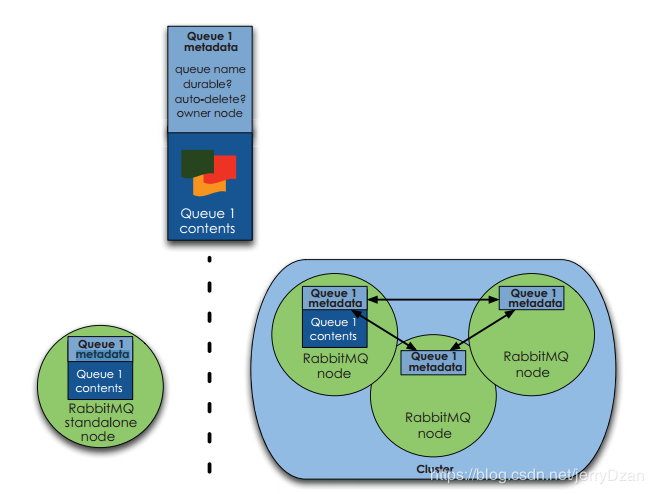

# rabbitmq常见面试题

**1.使用RabbitMQ有什么好处**
- 解耦:系统A在代码中直接调用系统B和系统C代码,如果将来D系统接入,系统A还需要修改代码,过于麻烦!
- 削峰:并发量大的时候,所有请求直接怼到数据库,造成数据库连接异常
- 异步,将消息写入消息队列,非必要的业务逻辑以异步的方式运行,加快响应速度

**2.RabbitMQ中broker是指什么?cluster又是指什么？**  
- broker是指一个或最多个erlang node的逻辑分组,且node上运行着RabbitMQ应用程序。cluster是在broker的基础之上,增加了node之间共享元数据的约束。

**3.RabbitMQ概念里的channel,exchange和queue是逻辑概念,还是对应着进程实体？分别起什么作用？**
- queue具有自己的erlang进程;exchange内部实现为保存binding关系的查找表;channel是实际进行路由工作的实体,即负责按照routing_key将message投递给queue。由AMQP协议描述可知,channel是真实TCP连接之上的虚拟连接,所有AMQP命令都是通过channel发送的,且每一个channel有唯一的ID。一个channel只能被单独一个操作系统线程使用,故投递到特定channel上的message是有顺序的。但一个操作系统线程上运行使用多个channel。

**4.vhost是什么？起什么作用？**
- vhost可以理解为虚拟broker,即mini-RabbitMQ server。其内部均含有独立的queue,exchange和binding等,等最最重要的是,其拥有独立的权限系统,可以做到vhost范围的用户控制。当然,从RabbitMQ的全局角度,vhost可以作为不同权限隔离的手段（一个典型的例子就是不同的应用可以泡在不同的vhost中）

**5.消息基于什么传输？**
- 由于TCP连接的创建和销毁开销较大,且并发数受系统资源限制,会造成性能瓶颈。RabbitMQ使用信道的方式来传输数据。信道是建立在真实的TCP连接内的虚拟连接,且每条TCP连接上的信道数量没有限制。

**6.消息如何分发？**
- 若该队列至少有一个消费者订阅,消息将以循环(round-robin)的方式发送给消费者。每条消息只会分发给一个订阅的消费者（前提是消费者能够正常处理消息并进行确认）。

**7.消息怎么路由？**  
  从概念上来说,消息路由必须有三部分:交换器,路由,绑定。生产者把消息发布到交换器上;绑定决定了消息如何从路由器路由到特定的队列;消息最终到达队列,并被消费者接收。
  1. 消息发布到交换器时,消息将拥有一个路由键（routing key）,在消息创建时设定。
  2. 通过队列路由键,可以把队列绑定到交换器上。
  3. 消息到达交换器后,RabbitMQ会将消息的路由键与队列的路由键进行匹配(针对不同的交换器有不同的路由规则)。如果能够匹配到队列,则消息会投递到相应队列中;如果不能匹配到任何队列,消息将进入"黑洞"。
  
  常用的交换器分为以下三种:
  - direct:如果路由键完全匹配,消息就被投递到相应的队列
  - fanout:如果交换器收到消息,将会广播到所有绑定队列上
  - topic:可以使来自不同源头的消息能够到达同一个队列。使用topic交换器时,可以使用通配符,比如:"*" 匹配特定位置的任意文本,"."把路由键分为了几部分,"#"匹配所有规则等。特别注意:发往topic交换器的消息不能随意的设置选择键（rotting_key）,必须是由"."隔开一系列的标识符组成。
  
  **8.什么是元数据？元数据分为哪些类型？包括哪些内容？与cluster相关的元数据有哪些？元数据是如何保存的？元数据在cluster中是如何分布的？
- 在非cluster模式下,元数据主要分为Queue元数据(queue名字和属性等),Exchange元数据(exchange名字,类型和属性等),Binding元数据(存放路由关系的查找表),Vhost元数据(vhost范围内针对前三者的名字空间约束和安全设置)。在cluster模式下,还包括cluster中node位置信息和node关系信息。元数据erlang node类型确定是仅保存于RAM中,还是同事保存在RAM和disk上。元数据在cluster中是全node分布的。下图所示为queue的元数据在单node和cluster两种模式下的分布图。
  

**9.在单node系统和多node构成的cluster系统中声明queue,exchange,以及进行binding会有什么不同？**  
答:当你在单node上声明queue时,只要该node上相关元数据进行了变更,你就会得到Queue.Declare-ok回应;而在cluster上声明queue,则要求cluster上的全部node都要进行元数据成功更新,才会得到Queue.Declare-ok回应。另外,若node类型为RAM node则变更的数据仅保存在内存中,若类型为disk node则还要变更保存在磁盘上的数据。

**死信队列&死信交换器**:DLX全称(Dead-Letter-Exchange),称之为死信交换器,当消息变成一个死信之后,如果这个消息所在的队列存在x-dead-letter-exchange参数,那么它会被发送到x-dead-letter-exchange对应值的交换器上,这个交换器就称之为死信交换器,与这个死信交换绑定的队列就是死信队列。

**10.如何确保消息正确地发送至RabbitMQ?  
RabbitMQ使用发送方确认模式,确保消息正确地发送到RabbitMQ。发送方确认模式:将信道设置成confirm模式(发送方确认模式),则所有在信道上发布的消息都会被指派一个唯一的ID。一旦消息被投递到目的队列后,或者消息被写入磁盘后(可持久化的消息),信道会发送一个确认给生产者(包含消息唯一ID)。如果RabbitMQ发生内部错误从而导致消息丢失,会发送一条nack(not acknowledged,未确认)消息。发送方确认模式是异步的,生产者应用程序在等待确认的同时,可以继续发送消息。当确认消息到达生产者应用程序,生产者应用程序的回调方法就会被触发来处理确认消息。

**11.如何确保消息接收方消费了消息？**
接收方消息确认机制：消费者接收每一条消息后都必须进行确认（消息接收和消息确认是两个不同操作）。只有消费者确认了消息，RabbitMQ才能安全地把消息从队列中删除。这里并没有用到超时机制，RabbitMQ仅通过Consumer的连接中断来确认是否需要重新发送消息。也就是说，只要连接不中断，RabbitMQ给了Consumer足够长的时间来处理消息。  
下面罗列几种特殊情况：
- 如果消费者接收到消息，在确认之前断开了连接或取消订阅，RabbitMQ会认为消息没有被分发，然后重新分发给下一个订阅的消费者。（可能存在消息重复消费的隐患，需要根据bizId去重）
- 如果消费者接收到消息却没有确认消息，连接也未断开，则RabbitMQ认为该消费者繁忙，将不会给该消费者分发更多的消息。

**12.如何避免消息重复投递或重复消费？**  
在消息生产时，MQ内部针对每条生产者发送的消息生成一个inner-msg-id，作为去重和幂等的依据（消息投递失败并重传），避免重复的消息进入队列；在消息消费时，要求消息体中必须要有一个bizId（对于同一业务全局唯一，如支付ID、订单ID、帖子ID等）作为去重和幂等的依据，避免同一条消息被重复消费  
这个问题针对业务场景来答分以下几点：
1. 比如，你拿到这个消息做数据库的insert操作。那就容易了，给这个消息做一个唯一主键，那么就算出现重复消费的情况，就会导致主键冲突，避免数据库出现脏数据。

2. 再比如，你拿到这个消息做redis的set的操作，那就容易了，不用解决，因为你无论set几次结果都是一样的，set操作本来就算幂等操作。

3. 如果上面两种情况还不行，上大招。准备一个第三方介质,来做消费记录。以redis为例，给消息分配一个全局id，只要消费过该消息，将<id,message>以K-V形式写入redis。那消费者开始消费前，先去redis中查询有没消费记录即可。

**13、如何解决丢数据的问题?**  
1.生产者丢数据  
生产者的消息没有投递到MQ中怎么办？从生产者弄丢数据这个角度来看，RabbitMQ提供transaction和confirm模式来确保生产者不丢消息。

transaction机制就是说，发送消息前，开启事物(channel.txSelect())，然后发送消息，如果发送过程中出现什么异常，事物就会回滚(channel.txRollback())，如果发送成功则提交事物(channel.txCommit())。

然而缺点就是吞吐量下降了。因此，按照博主的经验，生产上用confirm模式的居多。一旦channel进入confirm模式，所有在该信道上面发布的消息都将会被指派一个唯一的ID(从1开始)，一旦消息被投递到所有匹配的队列之后，rabbitMQ就会发送一个Ack给生产者(包含消息的唯一ID)，这就使得生产者知道消息已经正确到达目的队列了.如果rabiitMQ没能处理该消息，则会发送一个Nack消息给你，你可以进行重试操作。

2.消息队列丢数据  
处理消息队列丢数据的情况，一般是开启持久化磁盘的配置。这个持久化配置可以和confirm机制配合使用，你可以在消息持久化磁盘后，再给生产者发送一个Ack信号。这样，如果消息持久化磁盘之前，rabbitMQ阵亡了，那么生产者收不到Ack信号，生产者会自动重发。

那么如何持久化呢，这里顺便说一下吧，其实也很容易，就下面两步

①、将queue的持久化标识durable设置为true,则代表是一个持久的队列

②、发送消息的时候将deliveryMode=2

这样设置以后，rabbitMQ就算挂了，重启后也能恢复数据。在消息还没有持久化到硬盘时，可能服务已经死掉，这种情况可以通过引入mirrored-queue即镜像队列，但也不能保证消息百分百不丢失（整个集群都挂掉）

3.消费者丢数据  
启用手动确认模式可以解决这个问题

①自动确认模式，消费者挂掉，待ack的消息回归到队列中。消费者抛出异常，消息会不断的被重发，直到处理成功。不会丢失消息，即便服务挂掉，没有处理完成的消息会重回队列，但是异常会让消息不断重试。

②手动确认模式，如果消费者来不及处理就死掉时，没有响应ack时会重复发送一条信息给其他消费者；如果监听程序处理异常了，且未对异常进行捕获，会一直重复接收消息，然后一直抛异常；如果对异常进行了捕获，但是没有在finally里ack，也会一直重复发送消息(重试机制)。

③不确认模式，acknowledge="none" 不使用确认机制，只要消息发送完成会立即在队列移除，无论客户端异常还是断开，只要发送完就移除，不会重发。

**14.死信队列和延迟队列的使用**  

死信消息:
1. 消息被拒绝（Basic.Reject或Basic.Nack）并且设置 requeue 参数的值为 false
2. 消息过期了
3. 队列达到最大的长度

过期消息：  
    在 rabbitmq 中存在2种方可设置消息的过期时间，第一种通过对队列进行设置，这种设置后，该队列中所有的消息都存在相同的过期时间，第二种通过对消息本身进行设置，那么每条消息的过期时间都不一样。如果同时使用这2种方法，那么以过期时间小的那个数值为准。当消息达到过期时间还没有被消费，那么那个消息就成为了一个 死信 消息。

    队列设置：在队列申明的时候使用 x-message-ttl 参数，单位为 毫秒

    单个消息设置：是设置消息属性的 expiration 参数的值，单位为 毫秒

延时队列：在rabbitmq中不存在延时队列，但是我们可以通过设置消息的过期时间和死信队列来模拟出延时队列。消费者监听死信交换器绑定的队列，而不要监听消息发送的队列。

有了以上的基础知识，我们完成以下需求：

需求：用户在系统中创建一个订单，如果超过时间用户没有进行支付，那么自动取消订单。

分析：

            1、上面这个情况，我们就适合使用延时队列来实现，那么延时队列如何创建

        2、延时队列可以由 过期消息+死信队列 来时间

        3、过期消息通过队列中设置 x-message-ttl 参数实现

        4、死信队列通过在队列申明时，给队列设置 x-dead-letter-exchange 参数，然后另外申明一个队列绑定x-dead-letter-exchange对应的交换器。

15、使用了消息队列会有什么缺点?
1. 系统可用性降低:你想啊，本来其他系统只要运行好好的，那你的系统就是正常的。现在你非要加个消息队列进去，那消息队列挂了，你的系统不是呵呵了。因此，系统可用性降低

2. 系统复杂性增加:要多考虑很多方面的问题，比如一致性问题、如何保证消息不被重复消费，如何保证保证消息可靠传输。因此，需要考虑的东西更多，系统复杂性增大。
