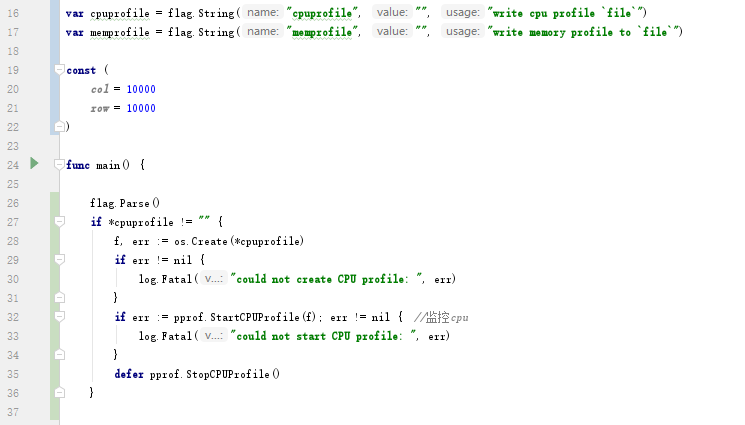
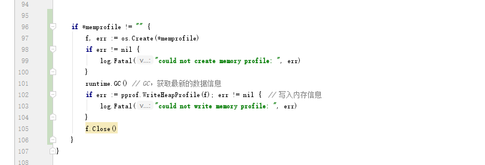

# Go程序员的演变

**单元测试:**

go test -v main_test.go  main.go

**PProf:**

1.头部(逻辑代码运行前)加上如下代码

2.尾部(逻辑代码运行后)加上如下代码

3.编译运行，会根据入参生成两个对应的数据文件：

$ go build

$ ./main -cpuprofile cpu.prof -memprofile mem.prof

4.利用go tool工具可视化

$ go tool pprof cpu.prof

$ (pprof) web

