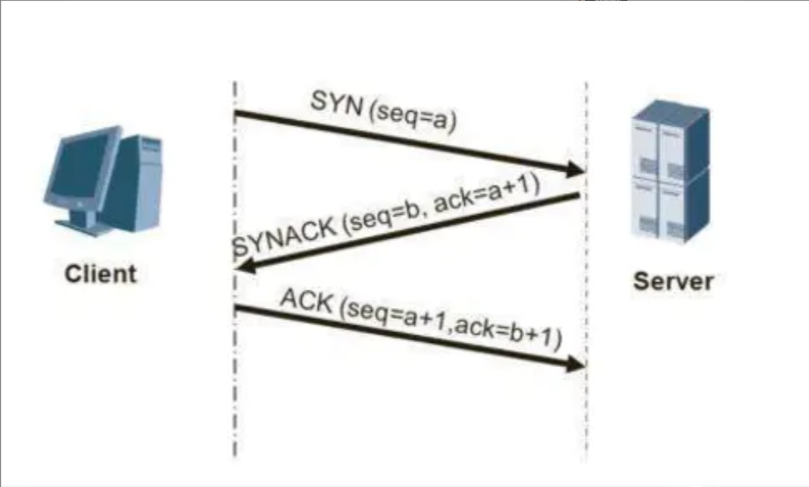
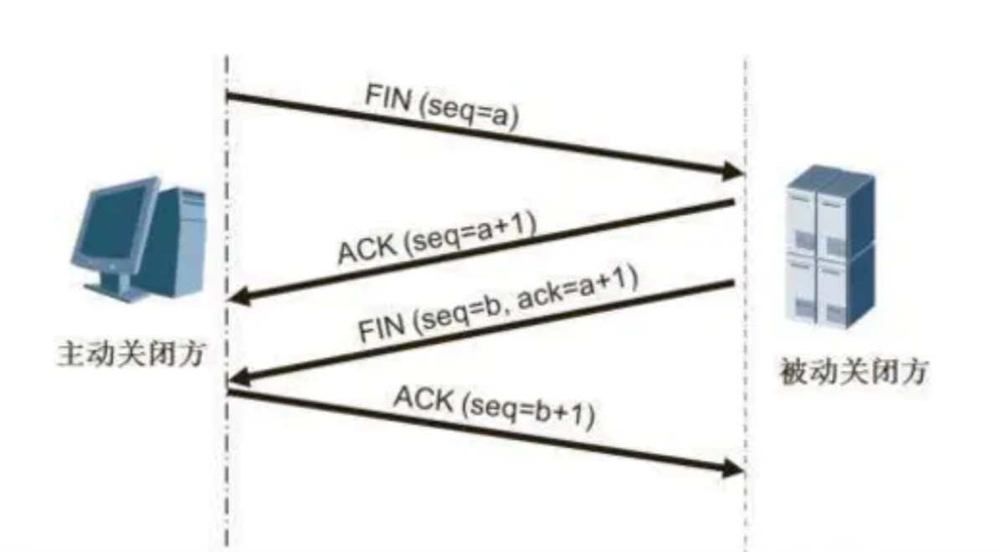
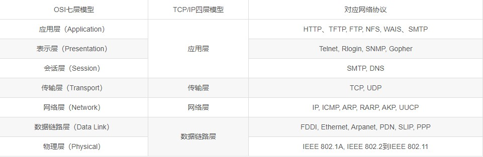

#TCP-三次握手和四次挥手简单理解

**三次握手（three-way handshaking）**

1.背景:TCP位于传输层,作用是提供可靠的字节流服务,为了准确无误地将数据送达目的地,TCP协议采纳三次握手策略。

2.原理:
1. 发送端首先发送一个带有SYN(synchronize)标志地数据表给接收方。
2. 接收方接收后,回传一个带有SYN/ACK标志的数据包传递确认信息,表示我收到了。
3. 最后,发送方再回传一个带有ACK标志的数据包,代表我知道了,表示'握手'结束。

通俗的说法
1. Client:嘿,李四,是我,听到了吗？
2. Server:我听到了,你能听到我的吗？
3. Client:好的,我们互相都能听到对方的话,我们的通信可以开始了。
  
  
**四次挥手(Four-Way-Wavehand)**

1.意义:当被动方收到主动方的FIN报文通知时,它仅仅表示主动方没有数据再发送给被动方。但未必被动方所有的数据都完整的发送给了主动方,所以被动方不会马上关闭SOCKET,它可能还需要发送一些数据给主动方后,再发送FIN报文给主动方,告诉主动方同意关闭连接,所以这里的ACK报文和FIN报文多数情况下都是分开发送的。

2.原理:
 1. 第一次挥手:Client发送一个FIN,用来关闭Client到Server的数据传送,Client进入FIN_WAIT_1状态。
 2. 第二次挥手:Server收到FIN后,发送一个ACK给Client,确认序号为收到序号+1(与SYN相同,一个FIN占用一个序号),Server进入CLOSE_WAIT状态。
 3. 第三次挥手:Server发送一个FIN,用来关闭Server到Client的数据传送,Server进入LAST_ACK状态。
 4. 第四次挥手:Client收到FIN后,Client进入TIME_WAIT状态,接着发送一个ACK给Server,确认序号为收到序号+1,Server进入CLOSED状态,完成四次挥手
 
 通俗的说话
 1. Client:我所有东西说完了
 2. Server:我已经全部听到了,但是等等我,我还没有说完
 3. Server:好了,我已经说完了
 4. Client:好的,那我们的通信结束
   

【问题1】为什么连接的时候是三次握手，关闭的时候却是四次握手？

答：因为当Server端收到Client端的SYN连接请求报文后，可以直接发送SYN+ACK报文。其中ACK报文是用来应答的，SYN报文是用来同步的。但是关闭连接时，当Server端收到FIN报文时，很可能并不会立即关闭SOCKET，所以只能先回复一个ACK报文，告诉Client端，"你发的FIN报文我收到了"。只有等到我Server端所有的报文都发送完了，我才能发送FIN报文，因此不能一起发送。故需要四步握手。

【问题3】为什么不能用两次握手进行连接？

答：3次握手完成两个重要的功能，既要双方做好发送数据的准备工作(双方都知道彼此已准备好)，也要允许双方就初始序列号进行协商，这个序列号在握手过程中被发送和确认。

   现在把三次握手改成仅需要两次握手，死锁是可能发生的。作为例子，考虑计算机S和C之间的通信，假定C给S发送一个连接请求分组，S收到了这个分组，并发 送了确认应答分组。按照两次握手的协定，S认为连接已经成功地建立了，可以开始发送数据分组。可是，C在S的应答分组在传输中被丢失的情况下，将不知道S 是否已准备好，不知道S建立什么样的序列号，C甚至怀疑S是否收到自己的连接请求分组。在这种情况下，C认为连接还未建立成功，将忽略S发来的任何数据分 组，只等待连接确认应答分组。而S在发出的分组超时后，重复发送同样的分组。这样就形成了死锁。

附录：
   
